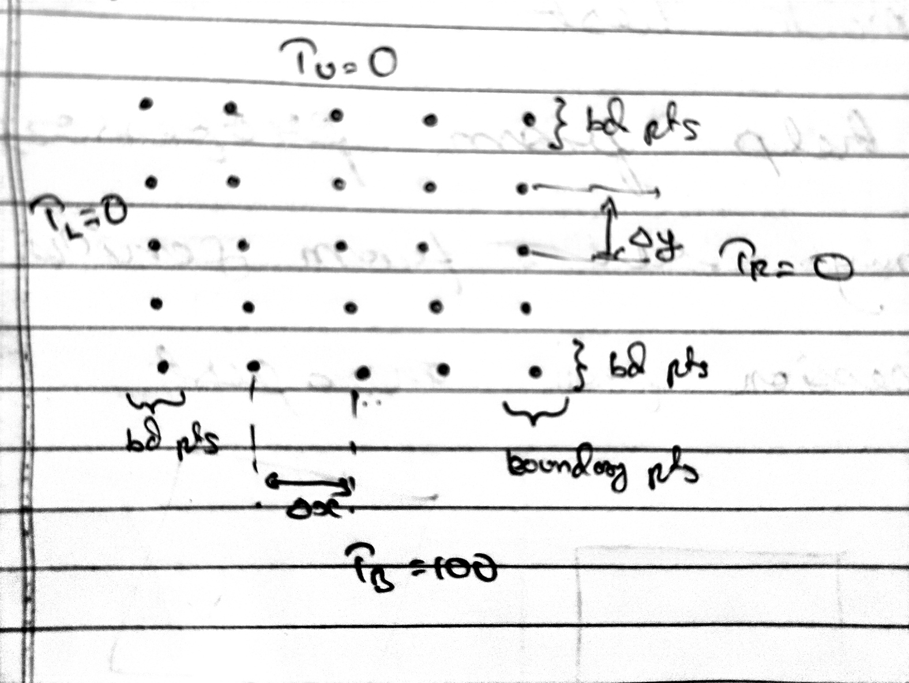
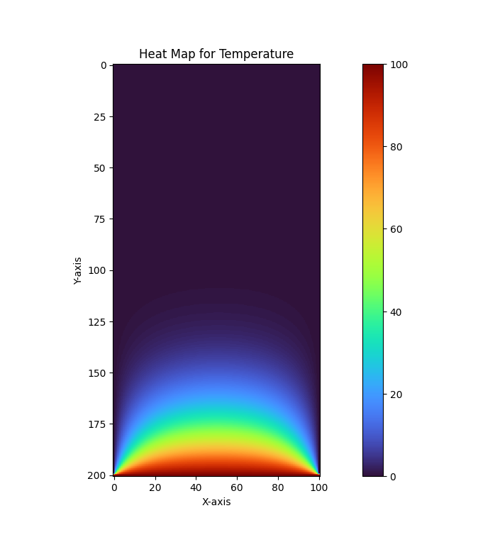
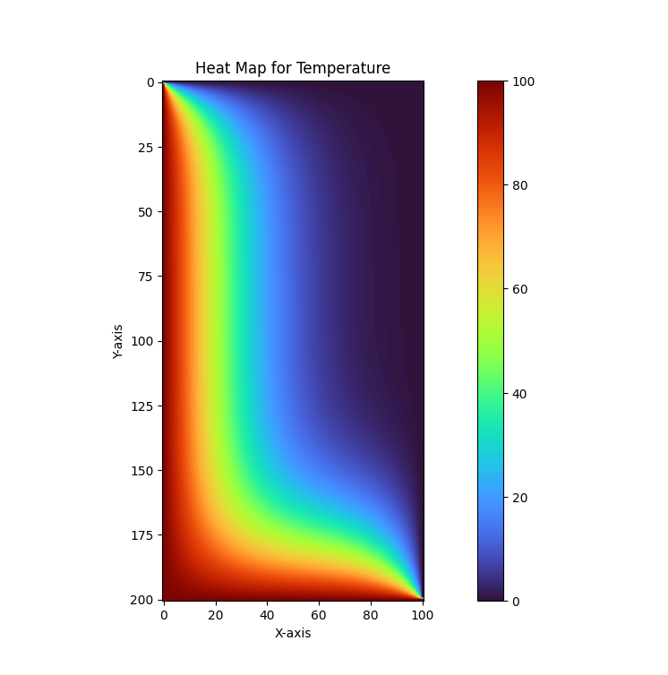

# temp

# Q3. 2-D rectangular plate

### Grid Generation

This is a 2-D problem and thus the grid points are spread out in two dimensions as shown below.

### Governing equations

This is a problem of steady-state head conduction in 2-D with no heat generation given the four faces are kept at a constant temperature. Governing differential equations for such problems is:

$$
\frac{\partial^2 T}{\partial x^2} + \frac{\partial^2 T}{\partial y^2} = 0
$$

Boundary conditions are:

$$
T_{x=0} = 0
$$

$$
T_{x=M} = 0
$$

$$
T_{y=0} = 100
$$

$$
T_{y=N} = 0
$$

### Discretizing the governing equation:

$$
\frac{T_{i+1, j} - 2T_{i, j}+T_{i-1, j}}{\Delta x ^2} + \frac{T_{i, j+1} - 2T_{i, j}+T_{i, j-1}}{\Delta y ^2} = 0
$$

$$
\left(\frac{1}{\Delta x ^2}\right) T_{i+1, j}
+ 
\left(\frac{1}{\Delta x ^2}\right) T_{i-1, j}
+
\left(\frac{1}{\Delta y ^2}\right) T_{i, j+1}
+
\left(\frac{1}{\Delta y ^2}\right) T_{i, j-1}
-2
\left(\frac{1}{\Delta x ^2} + \frac{1}{\Delta y ^2}\right) T_{i, j} = 0
$$

### Output

Below are the results generated for $\Delta x = 0.01m$ and $\Delta y = 0.01m$ and $1000$ iterations.

Hotter regions are represented by red while colder regions are represented by blue.

If you change the boundary condition of the left side to be $T_L = 100$, then the result would look something like this:

